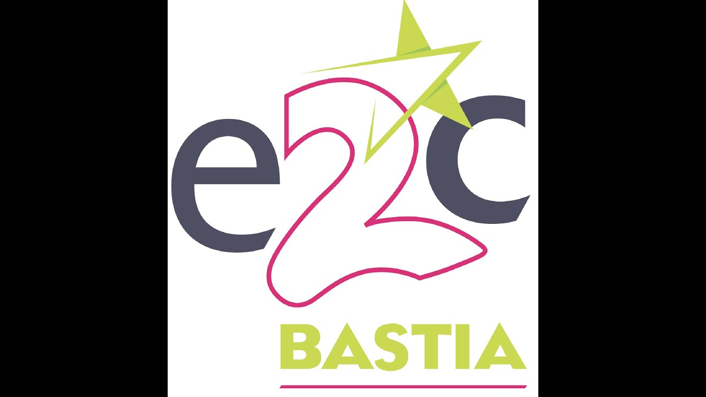

# 🎲 E2C JDR

<p align="center">
  
</p>

<p align="center">
  <strong>Plateforme immersive de jeu de rôle • Univers original</strong><br/>
  <em>Frontend moderne • UI/UX • Expérimentation technique</em>
</p>

---

<p align="center">
  
  
  
  
  
</p>

---

## 🧭 Aperçu

**E2C JDR** est une plateforme web en cours de développement dédiée à un univers original de jeu de rôle.

Ce projet sert de :

- laboratoire d’expérimentation frontend
- démonstration de compétences techniques
- base évolutive vers une application plus complète

---

## 🎯 Objectifs

- Maîtriser **Tailwind CSS** en profondeur
- Consolider les fondamentaux **HTML / CSS / JavaScript**
- Concevoir une **interface immersive et responsive**
- Mettre en place une **architecture frontend évolutive**

---

## 🛠️ Stack technique

| Technologie        | Usage           |
| ------------------ | --------------- |
| HTML5              | Structure       |
| Tailwind CSS       | Design & layout |
| JavaScript Vanilla | Interactivité   |
| Font Awesome       | Icônes          |

---

## ✨ Fonctionnalités

- 🔹 Navigation responsive
- 🔹 Menu mobile animé
- 🔹 Menus déroulants interactifs
- 🔹 Détection automatique de la page active
- 🔹 Carte du monde (_Rouenne_)
- 🔹 Interface adaptative (mobile / desktop)
- 🔹 Simulation de connexion côté frontend

---

## 🔐 Accès de démonstration

Ce projet inclut une **simulation de connexion** destinée uniquement à illustrer l’interface utilisateur.

Aucune authentification réelle n’est implémentée (pas de backend ni de gestion sécurisée des identifiants).

**Identifiants de test :**

```txt id="login-clean"
Email : test@gmail.com
Mot de passe : test1234
```

---

## 📂 Structure du projet

```bash id="n3x9qp"
/
├── image/
│   ├── background.jpg
│   ├── logo.jpg
│   └── map.jpg
├── js/
│   └── tailwind.config.js
├── pages/
│   ├── info.html
│   └── login.html
├── index.html
├── README.md
└── .gitattributes
```

---

## 🚀 Démarrage

```bash id="m1zk29"
git clone https://github.com/<username>/<repository>.git
cd <repository>
```

Puis ouvrir `index.html`.

Or go to : https://angebiancamaria.github.io/DnD-world/
---

## 🧱 Roadmap

- 🔲 Pages : personnages, factions, lore
- 🔲 Composants interactifs avancés
- 🔲 Architecture modulaire
- 🔲 Optimisation des performances et du SEO

---

## 📖 Objectif pédagogique

Ce projet vise à :

- pratiquer dans un cadre concret
- expérimenter des patterns modernes
- construire une base solide en frontend

---

## 🤝 Contribution

Projet personnel, mais les retours sont toujours appréciés.

---

## 📄 Licence

Utilisation libre à des fins d’apprentissage.
